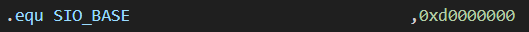
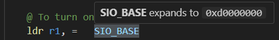

# arm-vs-code-extension

This VS Code extension adds hover-based expansion of `.equ` symbolic constants commonly used in ARM assembly files.

Since this extension is not published on the Visual Studio Marketplace, you can install it manually by following these steps.

## Features

- Highlights `.equ` symbolic constants and their usages.
- Hovering over a symbol shows its defined value.
- Lightweight, with no extra configuration needed.

  
*Definition of symbolic constants using `.equ`*

  
*Hover shows what each symbol expands to*


## ⚙️ Requirements

- Visual Studio Code
- Node.js and npm (for building from source)

## 🛠 Manual Installation Guide

Since this extension is not published on the Visual Studio Marketplace, you can install it manually:

### 1. Clone the repository

```bash
git clone https://github.com/VitriolOlja/arm-vs-code-extension.git
cd arm-vs-code-extension
```

### 2. Install dependencies

```bash
npm install
```

### 3. Compile the extension

```bash
npm run compile
```

### 4. Package the extension

Make sure `vsce` is installed globally:

```bash
npm install -g @vscode/vsce
```

Then package the extension:

```bash
vsce package
```

This will generate a `.vsix` file, e.g.:

```
arm-vs-code-extension-1.0.0.vsix
```

### 5. Install the extension in VS Code

```bash
code --install-extension arm-vs-code-extension-1.0.0.vsix
```

If updating an existing install, use the `--force` flag:

```bash
code --install-extension arm-vs-code-extension-1.0.0.vsix --force
```

## Requirements

No dependencies. It works out of the box.

## Extension Settings

This extension does not currently contribute any user-configurable settings.

## Known Issues

No known issues at the moment.  
Feel free to open an issue or pull request if you encounter a problem or want to suggest an improvement.

## Release Notes

### 1.0.0

- Initial release
- Parses `.equ` statements and maps symbols to values
- Adds hover decorations for all usages of defined symbols
- Currently only supports simple constant values (no expressions or nested macros)

---

## Contributing

Contributions are welcome! Feel free to fork the repo and submit a pull request.

## License

MIT
